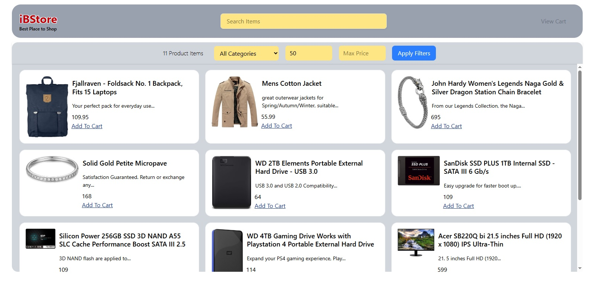

# iBStore

##### A simple fashion & clothing e-commerce application utilizing a public api - with a JavaScript & HTML/ Tailwind CSS frontend.

#### By **EDWIN MWANIKI**

## Description

An E-Commerce Application built using JavaScript/ HTML/ Tailwind CSS. It implements GET operations on JSON Server - using the fetch METHODS - GET. Users can view product items, do search and filter using category and min-max price.

## Screenshot



## Features

- Simple and clean UI design 
- All Components are on one page


## How to Use

### Requirements for use

- A computer, tablet, or phone
- Access to the internet
- A modern web browser

### View Live Site

Visit the deployed application at: [iBStore - Ecommerce 
App](https://edwin3v3.github.io/ibstore/) 

The live site allows you to:

- View products items from ecommerce json api
- Search products using any term
- Filter products via Category and Max/Min Price

### Local Development

If you want to run the project locally, you'll need:

- Node.js installed on your computer
- Terminal/Command Line (CLI)
- Basics of using Terminal/ CLI
- Code editor (VS Code recommended)


#### Installation Process

1. Clone this repository using:

   ```bash
   git clone git@github.com:edwin3v3/ibstore.git
   ```

   or by downloading a ZIP file of the code.

2. Navigate to the project directory:

   ```bash
   cd ibStore
   ```

3. Install the required dependencies:

   ```bash
   npm install
   ```

4. Open your browser and visit `http://localhost:5501` or whichever Local live server Your Code Editor provides or your Local Setup has afforded you.
   
    **Note**: VS Code Editor does a good job of providing a Live Server

## Technologies Used

- Tailwind CSS
- HTML
- JavaScript (ES6)

## Related Repositories

### Backend API

- Deployed API (E-commerce API): [Live API URL](https://fakestoreapi.com/products)

## Support and Contact Details

If you have any questions, suggestions, or need assistance, please contact:

- Email: <edwin.mwaniki@student.moringaschool.com>

## License

MIT License

Copyright &copy; 2025 EDWIN MWANIKI