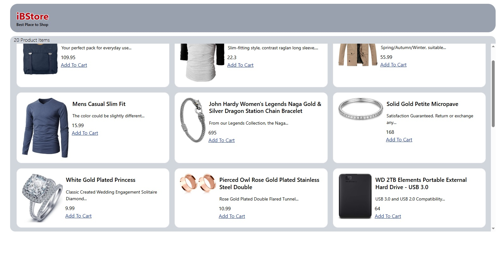

# iBStore

##### A simple fashion & clothing e-commerce application utilizing a public api - with a JavaScript & HTML/ Tailwind CSS frontend.

#### By **EDWIN MWANIKI**

## Description

An E-Commerce Application built using JavaScript/ HTML/ Tailwind CSS. It implements CRUD operations on JSON Server - using the fetch METHODS - POST, GET, UPDATE, DELETE. Users can view product items, view individual items, do search, filter and lastly do a simplified management of a cart

## Screenshot

## Features

- Simple and clean UI design 
- All Components are on one page

## How to Use

### Requirements for use

- A computer, tablet, or phone
- Access to the internet
- A modern web browser

### View Live Site

Visit the deployed application at: [iBStore - Ecommerce 
App](https://edwin3v3.github.io/ibstore/)

## Support and Contact Details

If you have any questions, suggestions, or need assistance, please contact:

- Email: <edwin.mwaniki@student.moringaschool.com>

## License

MIT License

Copyright &copy; 2025 EDWIN MWANIKI

Permission is hereby granted, free of charge, to any person obtaining a copy of this software and associated documentation files (the "Software"), to deal in the Software without restriction, including without limitation the rights to use, copy, modify, merge, publish, distribute, sublicense, and/or sell copies of the Software, and to permit persons to whom the Software is furnished to do so, subject to the following conditions:

The above copyright notice and this permission notice shall be included in all copies or substantial portions of the Software.

THE SOFTWARE IS PROVIDED "AS IS", WITHOUT WARRANTY OF ANY KIND, EXPRESS OR IMPLIED, INCLUDING BUT NOT LIMITED TO THE WARRANTIES OF MERCHANTABILITY, FITNESS FOR A PARTICULAR PURPOSE AND NONINFRINGEMENT. IN NO EVENT SHALL THE AUTHORS OR COPYRIGHT HOLDERS BE LIABLE FOR ANY CLAIM, DAMAGES OR OTHER LIABILITY, WHETHER IN AN ACTION OF CONTRACT, TORT OR OTHERWISE, ARISING FROM, OUT OF OR IN CONNECTION WITH THE SOFTWARE OR THE USE OR OTHER DEALINGS IN THE SOFTWARE.